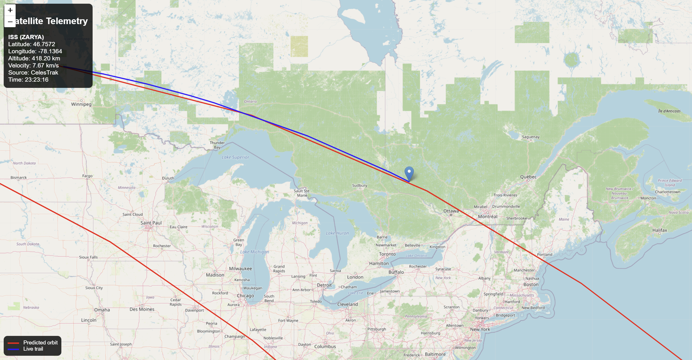
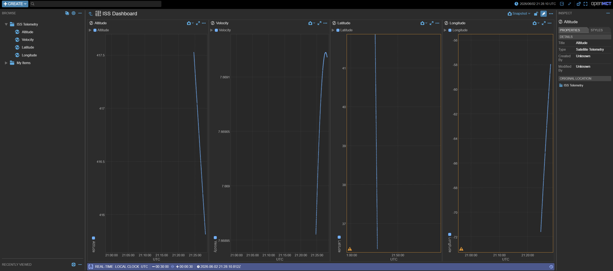

# Satellite-Mission-Dashboard

## Overview

Satellite Mission Dashboard is a C++20 application for real-time satellite tracking and orbit visualization.

The system downloads current TLE (Two-Line Element) data from CelesTrak, propagates the orbit using the SGP4 model, exposes telemetry through a REST API, and visualizes the results using both a custom Leaflet dashboard and NASA Open MCT.

The project demonstrates the integration of orbital mechanics, backend development, telemetry processing, and modern visualization tools.

---

## Satellite Selection

The application supports tracking different satellites without recompilation.

By default, the program tracks the International Space Station (ISS), but any satellite with a valid NORAD Catalog ID can be selected at startup.

### Usage

Run the application with a NORAD ID as a command-line argument:

```bash
./build/SatelliteMissionDashboard <NORAD_ID>
```

### Examples

ISS (ZARYA):

```bash
./build/SatelliteMissionDashboard 25544
```

Hubble Space Telescope:

```bash
./build/SatelliteMissionDashboard 20580
```

NOAA-19:

```bash
./build/SatelliteMissionDashboard 33591
```

### Implementation Note

Originally, the project was designed to track only the ISS. The system was later extended to support dynamic satellite selection by downloading TLE data for any NORAD ID provided at startup.

This improvement removes the need to modify the source code or rebuild the project when switching between satellites.


## Features

### Orbital Mechanics

* Automatic TLE download from CelesTrak
* TLE parsing
* SGP4 orbit propagation
* Real-time satellite position calculation
* Altitude and velocity computation

### REST API

Available endpoints:

```text
GET /health
GET /telemetry/current
GET /telemetry/orbit
GET /dashboard
```

### Leaflet Dashboard

* Interactive world map
* Real-time ISS position tracking
* Predicted orbit visualization
* Live trail visualization
* Telemetry information panel

### Open MCT Integration

* Real-time telemetry streaming
* Altitude monitoring
* Velocity monitoring
* Latitude monitoring
* Longitude monitoring
* Custom telemetry dashboard

---

## Technology Stack

### Backend

* C++20
* CMake
* cpp-httplib
* nlohmann/json
* OpenSSL

### Orbital Mechanics

* SGP4

### Frontend

* Leaflet
* OpenStreetMap

### Mission Control Dashboard

* NASA Open MCT

---

## System Architecture

```text
CelesTrak TLE
      |
      v
 TLE Downloader
      |
      v
  TLE Parser
      |
      v
     SGP4
      |
      v
Telemetry Engine
      |
      v
 REST API
   /   \
  /     \
Leaflet  Open MCT
```

---

## Screenshots

### Mission Map



### Open MCT Dashboard



---

## Build Instructions

### Clone Repository

```bash
git clone https://github.com/adamsokolowski2817-cmyk/Satellite-Mission-Dashboard.git
cd Satellite-Mission-Dashboard
```

### Build

```bash
cmake -B build
cmake --build build
```

### Run

```bash
./build/SatelliteMissionDashboard
```

The backend server will be available at:

```text
http://localhost:8090
```

### Open MCT

```bash
cd openmct-client
npm install
npm start
```

Open MCT will be available at:

```text
http://localhost:8080
```

---

## Future Improvements

* Multiple satellite support
* WebSocket telemetry streaming
* Ground station visibility prediction
* Pass prediction
* Telemetry recording and playback
* Docker deployment

---

## Author

Adam Sokołowski

AGH University of Science and Technology
Faculty of Computer Science
Computer Science (BSc)
